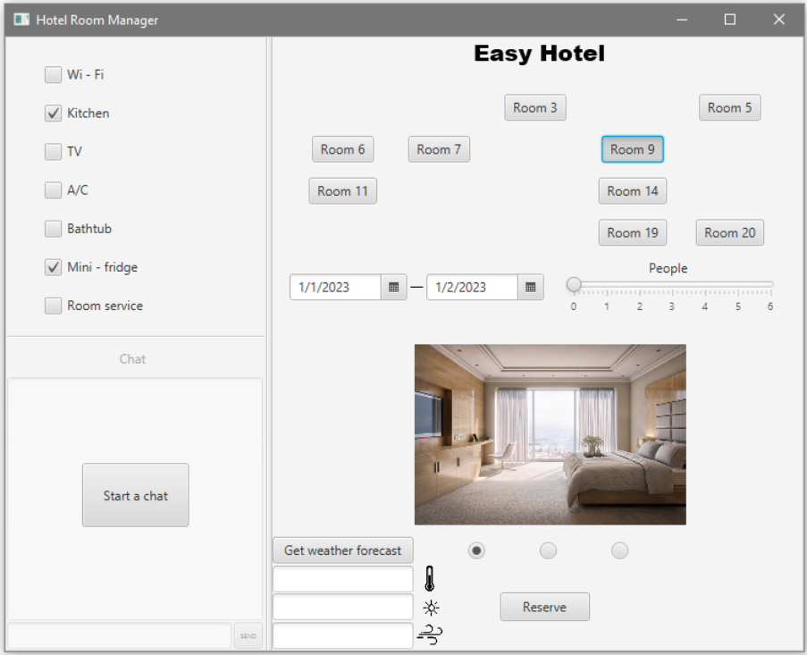

# HotelManager

## Въведение

### Цел.
   Документът цели да запознае читателите със системата Easy Hotel, която служи за резервация на хотелски стаи в семеен хотел. В документа са включени      детайли относно технологичния стек, начина на реализация на бизнес логиката и потребителския интерфейс.

### Резюме
   Документът поддържа следната структура:
       Въведение
       Използвани технологии
       Реализация на бизнес логиката
       Реализиране на потребителския интерфейс
       Внедряване на системата
       Разпределение на дейностите по реализацията

### Дефиниции и акроними

* API (Application Programming Interface)  - приложен програмен интерфейс

* RMI (Remote Method Invocation) - стандарт на Sun за разпределени обекти, написани на Java. RMI е отдалечено извикване на процедури (RPC), което позволява отдалечено стартиране на Java обекти (софтуерни компоненти), съхранявани в мрежата.

* Socket - сокетът се използва като крайна точка в комуникация между отделни системи в мрежата

* JavaFX - набор от графични и мултимедийни пакети, които позволяват на разработчиците да проектират, създават, тестват, отстраняват грешки и внедряват богати клиентски приложения.

* FXML - базиран на XML език за маркиране на потребителски интерфейс, създаден от Oracle Corporation за дефиниране на потребителския интерфейс на приложение JavaFX.

* .NET(Network Enable Technology) - междуплатформена платформа за разработчици с отворен код. .NET разполага с езици, редактори и библиотеки за създаване на уеб, мобилни и настолни приложения, игри и интернет на нещата.

## Използвани технологии

* Java - основната функционалност на приложението е разработена на Java

* RMI - осигурява механизма, чрез който сървърът и клиентът комуникират и си предават информация. 

* Java Socket - Чрез сокетите, сървърът, разработен на Java, комуникира със сървъра, разработен на .NET, и получава данни за метеорологичните условия в реално време.

* .NET (C#) - използвана е платформата .NET за разработване на подсистемата за извличане на метеорологичните условия в реално време за местоположението на хотела.

* HTTP - приложението използва HTTP протокол за комуникация с външен за системата API, който предоставя ресурси за метеорологичната обстановка.

## Реализация на бизнес логиката

   Системата за резервация на хотелски стаи е със стандартна двуслойна архитектура, състояща се от презентационен слой (Client) и логически слой (Server). За реализацията на презентационния слой сме използвали JavaFX, маркиращ език FXML и програмен език Java. При разработката са следвани добрите практики за семантичен FXML синтаксис. Клиентът комуникира със сървъра чрез използване на RMI технологията и получава данни, които визуализира на потребителския интерфейс. 
 
   Логическият слой е базиран на програмния език Java и чрез него е реализирана сървърната логика. Основната сървърна логика извършва комуникация с .NET API сървър, който обработва информацията относно метеорологичната обстановка, получена от външна за приложението услуга. Комуникацията между Java сървъра и .NET сървъра се извършва чрез използването на сокети. Комуникацията между .NET сървъра и външния API се извършва посредством HTTP протокол.

Фиг. 1. Архитектура на EasyHotel
			          

## Реализация на потребителския интерфейс
Интерфейсът е интуитивен за употреба. Той съдържа няколко секции. Основната секция е списък с наличните стаи, дати за резервация и филтър за капацитета на стаята. Приложени са също така набор от снимки за всяка избрана стая, възможност за проверка на метеорологичните условия в реално време в населеното място на хотела и бутон за резервация на избраната стая. Приложението също съдържа секция за чат, с който клиентът може да получи допълнителна информация относно начин за извършване на основните функции като резервиране, филтриране и т.н. В потребителския интерфейс е наличен и списък от квадратчета с отметки за филтриране на стаите по наличните услуги и характеристики. 

Фиг 2. Изглед на основния екран
	

Фиг 3. Изглед на основния екран след прилагане на филтри
	

Фиг 4. Изглед при кликване на бутона за резервиране на стая
	

## Внедряване на системата
В момента системата работи само под ОС Windows
### Стартиране на boot.bat файла от главната директория на проекта.
Файлът boot.bat стартира следните файлове : 
* bootServer.bat - този файл стартира Java сървъра.
* bootForecast.bat - този файл стартира C# сървъра.
* bootUI.bat. - този файл стартира клиента.
